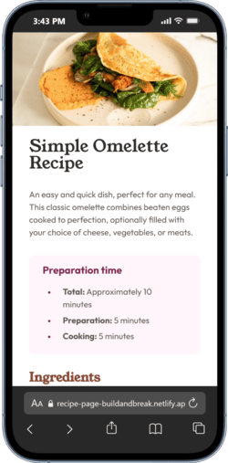
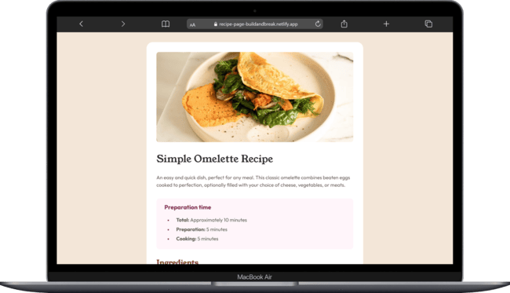

# Recipe Page

This is a recipe page built as part of a Frontend Mentor challenge.

## Table of contents

- [Overview](#overview)
  - [Screenshot](#screenshot)
  - [Links](#links)
- [My process](#my-process)
  - [Built with](#built-with)
  - [What I learned](#what-i-learned)
  - [Continued development](#continued-development)
  - [Useful resources](#useful-resources)
- [Author](#author)
- [Acknowledgments](#acknowledgments)

## Overview

It presents a Simple Omelette Recipe, including preparation time, ingredients, step-by-step instructions, and nutritional information.

The design focuses on readability, clear visual hierarchy, and a responsive layout suitable for both mobile and desktop screens.

### Screenshot

**Mobile Version**

**Laptop Version**

### Links

- Solution URL: [Recipe Page Solution](https://www.frontendmentor.io/solutions/responsive-recipe-page-using-flexbox-IHSxZInaS3)

- Live Site URL: [Recipe Page](https://recipe-page-buildandbreak.netlify.app/)

## My process

### Built with

- Semantic HTML5 – for meaningful, accessible, and SEO-friendly markup

- **CSS3** – including custom properties (variables) for colors, fonts, and weights, improving maintainability and theming

- **Flexbox** – for alignment and spacing, ensuring a consistent and centered layout

- **Responsive design** – mobile-first workflow to ensure the page scales from small to large screens

- **Google Fonts** – using Inter, Outfit, and Young Serif to establish a clear visual hierarchy

### What I learned

This project demonstrates:

- Effective use of CSS custom properties for consistent styling and easier maintenance.

- Structuring content semantically with HTML sections for ingredients, instructions, and nutrition tables.

- Designing a responsive layout that adapts gracefully to different screen sizes.

- Creating a clear visual hierarchy through color, font weight, and spacing.

### Continued development

- Adding dynamic interactions with JavaScript

- Exploring CSS Grid for more advanced layouts

- Further optimization for accessibility and semantic HTML

- Integrating the recipe page into a component-based framework like React

### Useful resources

- [Frontend Mentor](https://www.example.com) - This helped me for XYZ reason. I really liked this pattern and will use it going forward.

- [CSS Tricks](https://www.example.com) - This is an amazing article which helped me finally understand XYZ. I'd recommend it to anyone still learning this concept.

## Author

- Website - [Tiago Pereira](https://social-links-buildandbreak.netlify.app/)
- Frontend Mentor - [@BuildAndBreak](https://www.frontendmentor.io/profile/BuildAndBreak)
- Linkedin - [Tiago Pereira](https://www.linkedin.com/in/tiago-pereira-5a4698289/)
- Github - [@BuildAndBreak](https://github.com/BuildAndBreak)

## Acknowledgments

Thanks to Frontend Mentor for providing structured challenges that help developers practice front-end skills.
